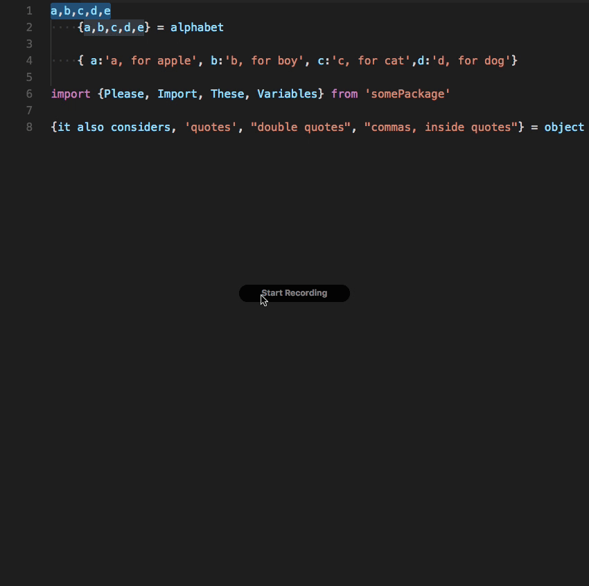

# README

This is a string manipulation tool for people who don't like very long comma separated list.

## Features



- Considers both single and double quotations
- Automatically indents the lines

## Install
Via Quick Open:

1. Download, install and open VS Code
2. Press cmd+p to open the Quick Open dialog
3. Type ext install break-from-comma
4. Click the Install button, then the Enable button

Via the Extensions tab:

1. Click the extensions tab or press cmd+shift+x
2. Search for paste and indent
3. Click the Install button, then the Enable button

Via the command line:

1. Open a command-line prompt
2. Run code --install-extension Rubymaniac.break-from-comma

## Keybinding

```
[
    {
        "key": "ctrl+shift+b",
        "command": "extension.breakFromComma",
        "when": "editorTextFocus && !editorReadonly"
    }
]
```

## Requirements

```
VSCode 1.5+
```

## Known Issues

For any bugs and feature requests please open an issue. For code contributions please create a pull request. Enjoy!

## Release Notes

See [CHANGELOG.md](CHANGELOG.md)
